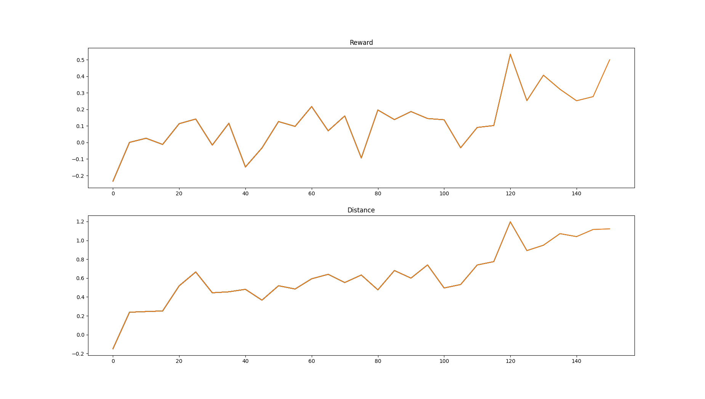

# Neural Control and Online Learning for Robust Locomotion of Legged Robots

This contains the CPG-RBFN and PIBB learning as well as the framework for working using IsaacGym. Example indirect learning:


This version contains a stable learning for the minicheeta robot and contains the B1 model.

### Content:
- [System Requirements](#system-requirements)
- [Code overview](#code-overview)
- [Install](#install)
- [Run the controller with learned weights](#run-the-controller-with-learned-weights)
- [Run learning algorithm](#run-learning-algorithm)
- [License](#license)

## System Requirements
This code has been tested with the following hardware and software:
- Intel® Core™ i9-9900K CPU @ 3.60GHz × 16
- GeForce RTX 2080
- Ubuntu 20.04.5 LTS
- Isaac Gym Preview 4
- Python 3.10.6

## Code overview

_This structure may change in the future._

The following explains the content of the seven main directories:
- **cache_init_values**: 
Contains cache values created by the program. In this version, these values are the initial values for the weights in the neural networks. 
- **configs**:
Contains the `.json` files for setting up the different URDF. They set up, for instance, the default joint configuration as well as Kd and Kp constants.
- **isaacGymConfig**:
Contains all the ncessary code for setting up IsaacGym simuulation as well as the configuration of the rewards.
- **learningAlgorithm**:
Contains the learning algorithms. In this version we have the PI^BB learning algorithm.
- **models**:
Contains all the URDF models.
- **modules**:
Contains the code for implementing CPG-RBFN as well as the code for logging the progress of the robot during its training.
- **runs**:
COntains the data from the runnings. The configuration of the training is saved as well. There are two examples (one using direct learning and the other using direct learning).

## Install

_Before installing this repo make sure to have the correct drives for your graphic card and check the [system requirements for IsaacGym](https://docs.omniverse.nvidia.com/app_isaacsim/app_isaacsim/requirements.html)._

1. Make sure to have installed pytorch with cuda. In this project pytorch 1.10 with cuda-11.3 has been used:

```bash
pip3 install torch==1.10.0+cu113 torchvision==0.11.1+cu113 torchaudio==0.10.0+cu113 -f https://download.pytorch.org/whl/cu113/torch_stable.html
```

2. Download and install Isaac Gym Preview 4 from its [official page](https://developer.nvidia.com/isaac-gym). Registration is needed.
3. Unzip the file via:

```bash
tar -xf IsaacGym_Preview_4.tar.gz
```

4. Install the python package:

```bash
cd isaacgym/python && pip install -e .
```

5. Verify the installation by running an example:

```bash
cd examples && python3 1080_balls_of_solitude.py
```

6. Clone this repository to your local machine:

```bash
git clone https://github.com/DFdz26/online-locomotion-rl
```

## Run the controller with learned weights

## Run learning algorithm

The learning is made using the locomotion_learning.py file.
There are some parameters than can be modify. Among these paraeters we can do:

- Decide either saving the generated data by the training switching the value SAVE_DATA to be True or False. 
- Loading the cache values for the weights in the NN switching the value of LOAD_CACHE True or False. 
- Selecting the robot chaning the config_file to the desired one. 
- Decide if the training will be direct or indirect learning changing the variable "encoding".
- Modify the reward weight and hyperparameters using reward_list.
- Modify the hyperparameters for the learning algoithm.

In order to start the training:

```bash
sudo python3 locomotion_learning.py
```

## License
All software is available under the [GPL-3](http://www.gnu.org/licenses/gpl.html) license.

[](https://www.gnu.org/licenses/gpl-3.0)
